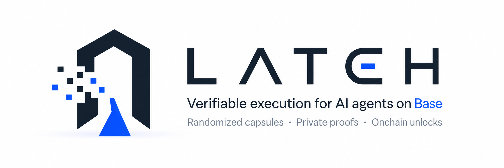
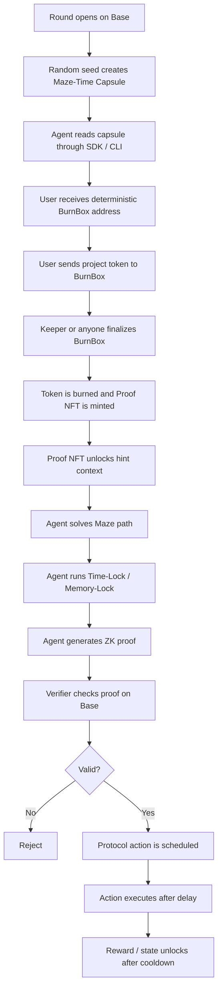

<p align="center">
  
</p>

<p align="center">
  <a href="LICENSE"></a>
  <a href="#status"></a>
  <a href="contracts/"></a>
  <a href="packages/"></a>
</p>

<p align="center">
  <b>Verifiable execution for AI agents on Base.</b><br />
  <i>Trust the proof, not the agent.</i>
</p>

---

## Contents

- [What LATCH does](#what-latch-does)
- [Protocol loop](#protocol-loop)
- [Why this exists](#why-this-exists)
- [Core components](#core-components)
- [Maze-Time Capsule](#maze-time-capsule)
- [Contract interactions](#contract-interactions)
- [Repository structure](#repository-structure)
- [Quick start](#quick-start)
- [Status](#status)
- [Security model](#security-model)
- [License](#license)

---

## What LATCH does

LATCH turns this flow:

```text
AI says it solved something
```

into this flow:

```text
Agent receives a capsule
Agent solves it offchain
Agent generates a proof
Base verifies the proof
Protocol action unlocks
Answer stays hidden
```

The core idea is simple:

```text
Agents solve.
Base verifies.
Contracts unlock.
```

---

## Protocol loop



---

## Why this exists

AI agents can read, write code, call APIs, and interact with wallets. The missing layer is not intelligence. It is verifiability.

LATCH gives agent workflows a protocol shape:

- the agent does work offchain;
- the chain verifies the work;
- the private answer is never revealed;
- protocol actions are triggered only by valid proofs;
- agent permissions are scoped by round, NFT, nullifier, and verifier.

The goal is to make Claude, Codex, and other agents more useful for Base-native applications without asking users or contracts to blindly trust the agent.

---

## Core components

| Module | Purpose |
|---|---|
| `RoundManager` | Creates rounds, records capsule commitments, validates proof submissions |
| `BurnBoxFactory` | Computes deterministic user/round burn addresses with CREATE2 |
| `BurnBox` | Receives project tokens, burns them, and mints proof credentials |
| `ProofNFT` | Soulbound round credential proving a user burned into a round |
| `IProofVerifier` | Interface for a real ZK verifier or zkVM verifier contract |
| `Treasury` | Holds protocol funds and exposes controlled release paths |
| `ActionLocker` | Delays and cools down unlocked protocol actions or rewards |
| `SDK` | Lets agents read rounds, compute BurnBox addresses, and parse capsules |
| `CLI` | Minimal `latch` terminal interface for Claude/Codex/local agents |

---

## Contract interactions

```text
                    ┌──────────────┐
                    │ RoundManager │ ◄── proof submission + verification
                    └──────┬───────┘
                           │ creates round, commits capsuleHash
          ┌────────────────┼────────────────┐
          ▼                ▼                ▼
  ┌──────────────┐  ┌────────────┐  ┌──────────────┐
  │ BurnBoxFactory│  │ ProofNFT   │  │ IProofVerifier│
  │   (CREATE2)  │  │(soulbound) │  │  (interface)  │
  └──────┬───────┘  └─────┬──────┘  └──────┬───────┘
         │ deploys        │ mints          │ verifies
         ▼                │                ▼
  ┌──────────┐            │       ┌────────────┐
  │ BurnBox  │            │       │ Mock/Real   │
  │(single-  │            │       │ Verifier    │
  │  use)    │            │       └────────────┘
  └────┬─────┘            │
       │ burns tokens     │
       │ mints ───────────┘
       ▼
  ┌──────────────┐
  │  Treasury    │
  │ ActionLocker │
  └──────────────┘
```

---

## Maze-Time Capsule

A LATCH round is not a riddle and not a hidden answer stored onchain.

Each round commits to a **Maze-Time Capsule**:

1. **Maze layer** — a randomized computation graph. The agent must infer a valid hidden path.
2. **Time-Lock layer** — a sequential computation derived from that path. It makes pure parallel brute force less dominant.
3. **Memory-Lock layer** — randomized memory access derived from the route key. It reduces the advantage of simple CUDA-style hash grinding.
4. **ZK layer** — the solver proves it found and executed a valid route without revealing the private route or final solution.

The capsule is public as data, but the solution is private.

<details>
<summary><b>Why this matters</b></summary>

Pure hash-grinding attacks (brute-forcing a hash output in parallel on GPUs) are the main shortcut for proof-of-work systems. The Maze-Time Capsule adds sequential and memory-hard constraints that make this approach less dominant, pushing the problem toward actual path-finding — work that AI agents are better suited for than hash ASICs.
</details>

---

## Repository structure

```text
latch-protocol/
├─ README.md
├─ docs/
│  ├─ architecture.md
│  ├─ protocol.md
│  ├─ sequence.md
│  ├─ capsule-design.md
│  ├─ agent-integration.md
│  ├─ threat-model.md
│  └─ roadmap.md
├─ contracts/
│  ├─ foundry.toml
│  ├─ src/
│  │  ├─ RoundManager.sol
│  │  ├─ BurnBoxFactory.sol
│  │  ├─ BurnBox.sol
│  │  ├─ ProofNFT.sol
│  │  ├─ Treasury.sol
│  │  ├─ ActionLocker.sol
│  │  ├─ LatchTypes.sol
│  │  ├─ OwnableLite.sol
│  │  ├─ interfaces/
│  │  └─ verifier/
│  ├─ script/
│  └─ test/
├─ packages/
│  ├─ sdk/
│  └─ cli/
├─ zk/
│  ├─ README.md
│  └─ programs/
└─ examples/
```

---

## Quick start

<details>
<summary><b>Setup instructions</b></summary>

Install dependencies:

```bash
pnpm install
```

Build TypeScript packages:

```bash
pnpm build
```

Build contracts:

```bash
cd contracts
forge build
```

Run the CLI skeleton:

```bash
pnpm latch -- help
pnpm latch -- round examples/capsule.round-18.json
```
</details>

---

## Status

This repository is a protocol scaffold and design reference.

Current state:

- CREATE2 BurnBox model included;
- soulbound Proof NFT included;
- round commitment and nullifier checks included;
- ZK verifier interface included;
- mock verifier included for local testing;
- Maze-Time Capsule format included;
- SDK and CLI skeleton included.

Not production-ready:

- no audited ZK circuit yet;
- no production verifier connected;
- no real VRF adapter wired;
- no production buyback executor;
- no security audit.

---

## Security model

LATCH assumes:

- answers must not be revealed onchain;
- agent output should not be trusted directly;
- burn addresses must not be externally owned wallets;
- keeper execution must be permissionless where possible;
- proofs must bind `roundId`, `capsuleHash`, `user`, `proofNftId`, `rewardAddress`, and `nullifier`;
- one proof must not unlock more than one action.

See [`docs/threat-model.md`](docs/threat-model.md) for full details.

<details>
<summary><b>Key trust assumptions</b></summary>

- The ZK verifier contract is assumed to be correct — if it can be tricked, the protocol falls apart.
- The VRF providing randomness for capsule generation must be verifiable and unbiasable.
- The keeper/permissionless finalization path must remain open so no single entity can gate participation.
- Agent operators are assumed economically rational — they will submit valid proofs to unlock rewards rather than wasting compute on invalid ones.
</details>

---

## License

[MIT](LICENSE)
