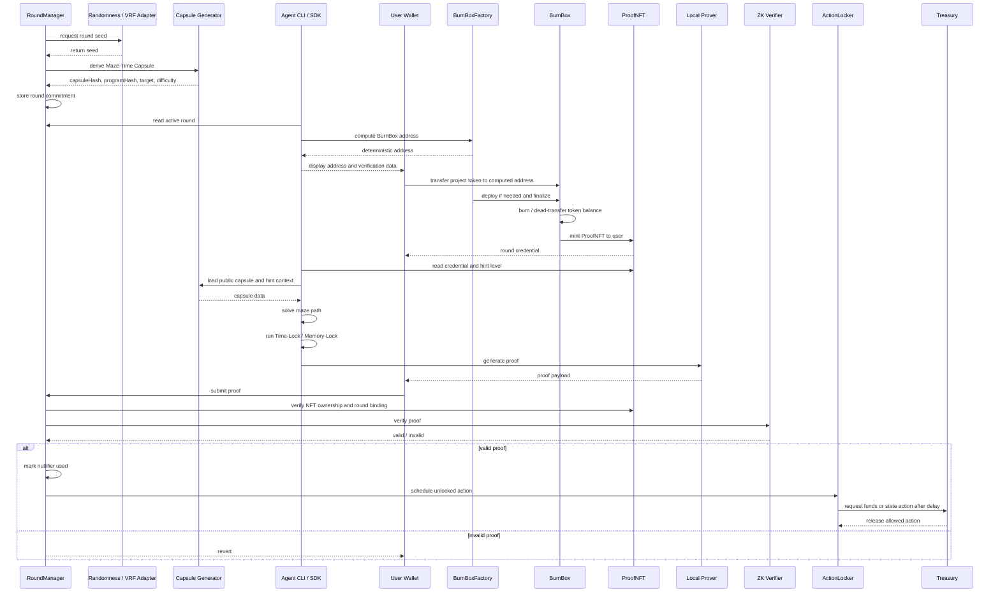

# Sequence

## Full sequence



## State machine

```text
RoundCreated
  → CapsuleCommitted
  → BurnBoxComputed
  → TokenDeposited
  → BurnFinalized
  → ProofNFTMinted
  → CapsuleSolvedOffchain
  → ProofSubmitted
  → ProofVerified
  → ActionScheduled
  → CooldownElapsed
  → ActionClaimed
```
